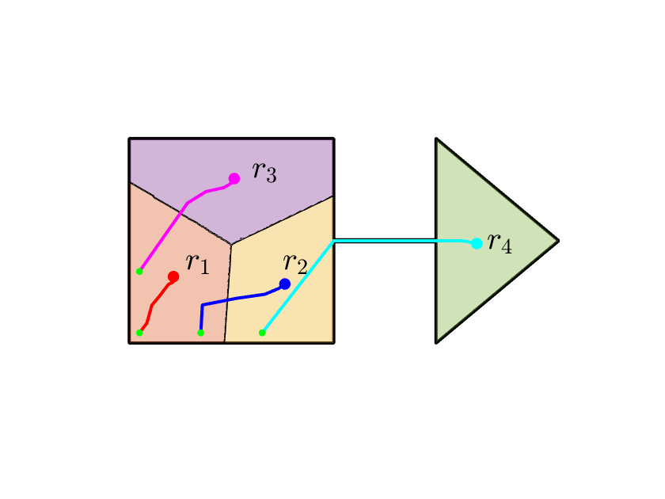
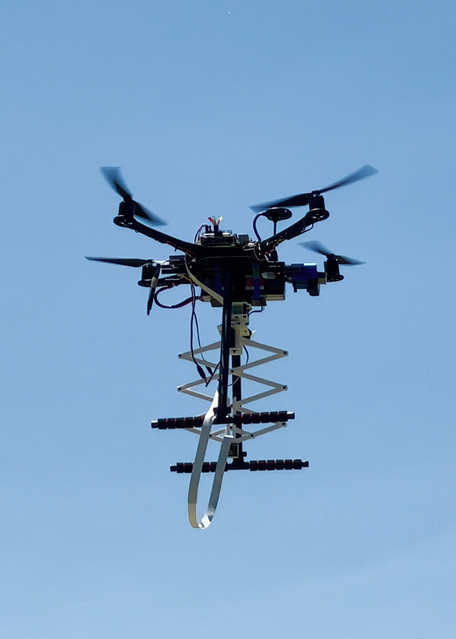

### @ California State University, Long Beach    

### @ North Carolina State University

* [**Assured Autonomy of Legged Robots**](https://liutairan.github.io/projects/) 
January 2022 - August 2022 

* [**Human Performance Augmentation with Exoskeletons**](https://liutairan.github.io/projects/human_performance_augmentation/) 
November 2021 - July 2022 

### @ University of Georgia     

* [**Human-Swarm Interactions and Multi-Robot System Autonomy**](https://liutairan.github.io/projects/trust_hsi/) 
January 2021 - October 2021 

* [**Coverage Control and Path Planning with Heterogeneous Robots**](https://liutairan.github.io/projects/coverage_path_planning/) 
September 2020 - August 2021 

* [**Aerial Robotics in Agricultural Measurements**](https://liutairan.github.io/projects/agriculture_measurement/) 
September 2020 - August 2021 

### @ Louisiana State University

* [**Multi-Agent System Formation Control**](https://liutairan.github.io/projects/formation_control/) 
July 2016 - May 2020 
<!-- Developed new formation control methods, provided mathematical proofs. -->
<!-- Conducted numerical and experimental validation. -->
<!--  -->

* [**Aerial Robotic Network in Precision Agriculture**](https://liutairan.github.io/projects/agriculture_robotic/) 
July 2016 - October 2019 
<!-- Designed and built a quadrotor fleet from scratch. -->
<!-- Developed autonomous flight control firmware on MCU and flight control/monitor applications on PC. -->
<!-- Developed distributed control network for quadrotors. -->
<!-- (Funded by the LSU Economic Development Assistantship (EDA) program.) -->
<!--  -->

* [**Computational Molecule Synthesis**](https://liutairan.github.io/projects/computational_molecule_synthesis/) 
October 2015 - May 2016 
<!-- Developed open-source software which can decompose large molecules to small bio-active fragments, then use fragments to generate target molecules or new molecules for drug design. -->
<!--  -->

* [**Multirotor Copters in Precision Agriculture Applications**](https://liutairan.github.io/projects/multirotor_agriculture/) 
February 2015 - June 2015 
<!-- Developed an application to process aerial images. -->
<!-- Optimized the software for better processing speed. -->
<!--  -->

<!-- ### @ University of Science and Technology of China -->

<!-- * [**Bionic Four-Tail Fin UUV (Mimic Dragonfly)**](https://liutairan.github.io/projects/four_tail_fin)  -->
<!-- August 2011 – January 2013  -->
<!-- Developed program on MCU for motor control, developed remote control and wireless data transfer programs on PC and MCU for the bionic UUV with four oscillatory tail fins. The tail fins were designed to mimic the motion pattern of a dragonfly. -->

<!-- * [**Bionic Long Undulatory Fin UUV (Mimic Black Ghost Knifefish)**](https://liutairan.github.io/projects/long_undulatory_fin)  -->
<!-- November 2011 – June 2012  -->
<!-- Designed and built a UUV to mimic the propulsion pattern of black ghost knifefish. -->
<!-- Developed program on Arduino for the UUV. -->
<!-- Studied the effects of the frequency and amplitude of the swaying fin ray, wave number in the fin surface, and the speed of the incoming flow on propulsion thrust. -->

<!-- * [**Bionic Double-Tail Fin UUV**](https://liutairan.github.io/projects/double_tail_fin)  -->
<!-- September 2011 – May 2012  -->
<!-- Conducted experiments to optimize the performance of the double tail fin UUV. -->
<!-- Developed a whole system to automatically conduct experiment, collect and process data, and plot results. -->

<!-- * [**Flow Trajectory Around Two Circular Cylinders**](https://liutairan.github.io/projects/flow_trajectory)  -->
<!-- October 2011 – November 2011  -->
<!-- Designed and built an adjustable two-circular-cylinder model for the experiment. -->
<!-- Conducted experiments with hydrogen bubbles, laser beam, and high resolution high speed camera to study the water flow trajectory around two circular cylinder. -->

<!-- * [**Composite Bionic Actuators**](https://liutairan.github.io/projects/composite_actuator)  -->
<!-- April 2011 – August 2011  -->
<!-- Assisted with motion pattern design. -->
<!-- Developed programs on Arduino for the actuators. -->

<!-- * [**Robo-Game Competition of USTC (2010)**](https://liutairan.github.io/projects/robo_game)  -->
<!-- June 2010 – October 2010  -->
<!-- Participated in prototyping and building of autonomous and manned robots. -->
<!-- Developed program on MCU for the autonomous robot. -->
