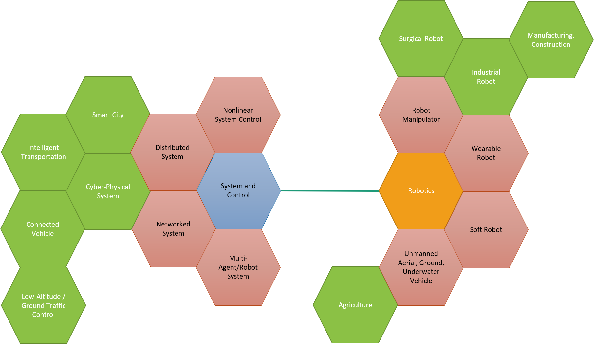

### Biography

Tairan Liu received his B.Sc. degree in Theoretical and Applied Mechanics at the <a href="http://en.ustc.edu.cn/" target="_blank">University of Science and Technology of China (USTC)</a>, Hefei, Anhui, China, in 2012, and the Ph.D. degree in Mechanical Engineering at <a href="https://www.lsu.edu/" target="_blank">Louisiana State University</a>, Baton Rouge, Louisiana, USA, in 2020. He held postdoctoral appointments at the University of Georgia (2020-2021) and North Carolina State University (2021-2022) until starting as an assistant professor of Mechanical and Aerospace Engineering at CSULB in August 2022. His research mainly focuses on control theory, multi-agent systems, and robotics.

<!-- I received my BS degree in Theoretical and Applied Mechanics at the <a href="http://en.ustc.edu.cn/" target="_blank">University of Science and Technology of China (USTC)</a>, and Ph.D. degree in Mechanical Engineering at <a href="https://www.lsu.edu/" target="_blank">Louisiana State University</a>. -->

<!--   -->
<!-- During my Ph.D. period, I worked at <a href="https://icorelab.github.io" target="_blank">iCORE Lab</a> in the <a href="https://www.lsu.edu/eng/mie/" target="_blank">Department of Mechanical and Industrial Engineering</a> at <a href="https://www.lsu.edu/" target="_blank">Louisiana State University</a>. My dissertation is entitled “Distance-Based Formation Control: Theory, Applications, and Issues” under the guidance of Dr. Marcio de Queiroz. I worked on multi-agent/robot system formation control problems and aerial robotic networks. I proposed new control algorithms with mathematical proofs, built a quadrotor fleet from scratch, developed micro-controller- and computer-based software, and conducted experiments to validate theories. -->

<!--   -->
<!-- After my Ph.D. graduation, I worked at the <a href="https://www.uga.edu/">University of Georgia</a> (UGA) as a postdoctoral fellow from September 2020 to October 2021. My research at UGA primarily focuses on multi-robot coverage control and path planning, deployment of robots for non-destructive agricultural sensing and measurements, intra-swarm or human-swarm interactions, and multi-agent system autonomy. -->

<!-- <a href="http://cscl.engr.uga.edu/" target="_blank">Dr. Javad Mohammadpour Velni’s lab</a> -->

<!--   -->
<!-- Currently, I am appointed as a postdoctoral research scholar working at the <a href="https://haosu-robotics.github.io/" target="_blank">Biomechatronics and Intelligent Robotics Lab</a> at <a href="https://www.ncsu.edu/">North Carolina State University</a>. My current research focuses on wearable, soft, and surgical robotics. -->

<!--   -->
<!-- I am open to tenure-track assistant professor positions. -->

<!--   -->
### Education   

* Ph.D., Mechanical Engineering, Louisiana State University, USA, 2020
* B.S., Theoretical and Applied Mechanics, University of Science and Technology of China, P.R. China, 2012

### Professional Appointments
* Assistant Professor, Department of Mechanical and Aerospace Engineering, California State University, Long Beach, 2022 - Present
* Postdoctoral Research Scholar, Department of Mechanical and Aerospace Engineering, North Carolina State University, 2021 - 2022
* Postdoctoral Fellow, Department of Electrical and Computer Engineering, University of Georgia, 2020 - 2021

### Research Interests
* System and Control Theory
* Multi-Agent / Robot System
* Cyber-Physical System
* Complex Network
* Large-Scale Networked System
* Cooperative Control
* Distributed System / Algorithm
* Human-Robot / Swarm Interaction
* Robotics
* Applications or intersections of the above areas:
  * Smart farming, precision agriculture, farm management, livestock management, aquaculture management
  * Intelligent transportation, ground / low-altitude traffic control, smart city, connected vehicles, urban air mobility, eVTOL
  * Multi-robot task allocation, smart manufacturing / construction, surgery, operation
  * Communication networks, social networks

### Teaching Interests
Dynamics, Control, Robotics

<!--  -->
