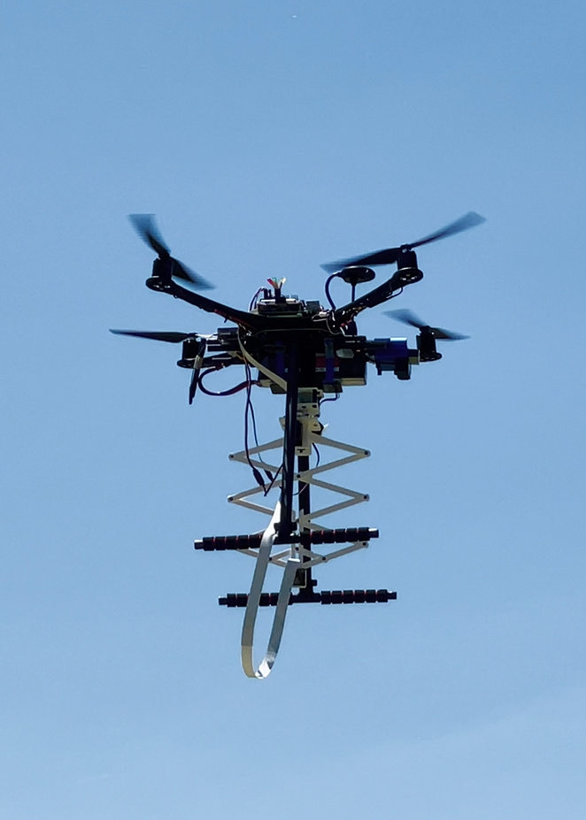

### Background

### Scientific Progress

Building an open-source drone platform for field monitoring, in which the drone is equipped with manipulation capability through a custom-designed telescopic structure that can carry a camera/sensor. The telescopic structure, when deployed, can penetrate through the plant canopy and collect information under/within the canopy – something that is not possible to do with the available technologies in the field today. The telescopic structure in our design is collapsible and therefore does not affect the drone taking off or landing. The camera/sensor on this structure can be replaced to capture various conditions. Furthermore, our team has recently started to develop an open-source software platform for a swarm deployment and monitoring. A graphical user interface (GUI) has been developed with basic capabilities for defining tasks, e.g., by manually choosing desired flight trajectory and also by automatically generating the desired flight trajectory from the coverage area. With the drone in mission, status data (e.g., location, altitude, attitude, battery level) are transmitted and displayed on the GUI. The GPS location of the drone is also shown on the map so that the operator can monitor the real-time trajectory along with the desired one. The platform developed has been tested so far for a single drone and we plan to expand the system to a swarm of drones.

### Our Testbed

### Demonstration
